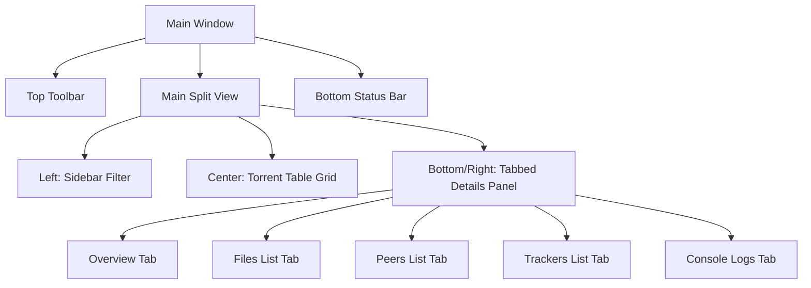
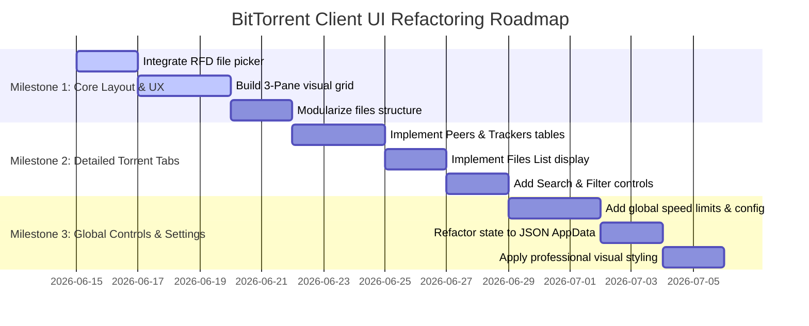

# BitTorrent Client UI & Functionality Improvement Plan

This document outlines the analysis of the current `torrent_client` desktop GUI application (built with `eframe`/`egui`) and lists concrete architectural, design, and user-experience suggestions to transform it into a professional-grade product.

---

## 1. Current State & Pain Points

The current desktop GUI client is implemented entirely in a single file [main.rs](file:///c:/Projects/BitTorrent/clients/torrent_client/src/main.rs). While functional and thread-safe, it displays several characteristics of a basic prototype rather than a finished product:

1. **Manual Path Entries**: Users must type out absolute paths for the `.torrent` file and `download directory`. This is highly error-prone, counter-intuitive, and lacks standard file/folder dialogue pickers.
2. **Minimal Visual Layout**: Torrents are listed as simple stacked panels inside a vertical scroll container. This takes up significant vertical space and doesn't scale well once multiple torrents are added.
3. **No Details Panel**: Critical information (individual file progress, connection statuses, peer details, tracker statistics) is hidden. Only raw global peer counts and overall speeds are displayed.
4. **Raw Console Logging**: The log screen is a simple text area at the bottom that grows indefinitely, lacks filters (Info, Debug, Error), and cannot be searched or cleared.
5. **Fragile State Persistence**: It serializes session lists to `torrent_client_state.txt` in the current working directory (CWD). If launched from a different folder, it creates a new state file, losing all previously loaded torrent progress.
6. **Lack of Global Statistics**: There is no footer status bar displaying total download/upload speeds, total ratios, or the global active torrent count.

---

## 2. Professional Product Suggestions

To elevate the client to a professional standard, we propose a modular, 3-pane desktop dashboard resembling standard clients (such as qBittorrent or Transmission).

### A. Layout & Visual Architecture (3-Pane Interface)
* **Sidebar Filter**: Left-hand sidebar panel to filter torrent lists by status: *All*, *Downloading*, *Seeding*, *Completed*, *Paused*, or *Active*.
* **Torrent Table Grid**: Replaces stacked groups with a structured grid layout using headers. Columns will include:
  * Name
  * Size
  * Progress (%) with a neat progress bar
  * Status badge (colored by state)
  * Download/Upload rate
  * ETA (Estimated Time of Arrival)
  * Peers (Connected/Swarm)
  * Seeders/Leechers (if available via Scrape)
  * Ratio (Uploaded / Downloaded)
* **Tabbed Detail Section**: Resides at the bottom or as a collapsable side panel:
  * **Overview**: Detailed transfer statistics, hash info, save path, elapsed time, and metadata.
  * **Files**: Lists all files in the torrent, showing individual sizes, progress, and download priority status (Skip, Normal, High).
  * **Peers**: Table displaying peer IP, client name, flag flags (Interested, Choked), and active download/upload speeds.
  * **Trackers**: List of tracker URLs, status messages, and re-announce interval times.
  * **Logs**: Screen displaying system logs with filter options (Info, Warning, Error) and a "Clear" button.
* **Bottom Status Bar**: Dedicated footer indicating global statistics:
  * Total download rate
  * Total upload rate
  * Global upload/download ratio
  * DHT status (e.g. "DHT: 124 nodes")
  * Connection port indicator (NAT-PMP / UPnP status)

### B. User Experience & Desktop Integration
* **File & Folder Dialogs**: Integrate the `rfd` (Rust File Dialog) crate. Provide clear buttons (e.g., "Browse...") to choose a `.torrent` file or select the output directory.
* **Separation of Magnet vs File**: Use clean toggle buttons or tabs for inputting a Local Torrent File vs pasting a Magnet URL.
* **Interactive Add Confirmation Dialog**: Before loading a torrent, prompt the user with a confirmation screen displaying files, sizes, and tracking details, allowing selective file unchecking before downloading starts.
* **Settings Dialog**: Introduce an options modal to configure:
  * Default save paths.
  * Maximum active downloads and upload slots.
  * Global speed limits (Download/Upload).
  * Network settings (listening ports, DHT toggle, MSE encryption options).

### C. Technical & Code Refactoring
* **App State Serialization**: Replace `torrent_client_state.txt` with a standardized JSON configuration using `serde` and `serde_json`.
* **Standard Settings Path**: Save configuration files in standard OS directory paths (e.g., `%APPDATA%/BitTorrent-rs/` on Windows) using the `dirs` crate.
* **Modular Code Structure**: Break `main.rs` into logical sub-modules:
  * `ui/components/`: Torrent table, sidebar, details panel, logs panel.
  * `ui/dialogs/`: Add torrent dialog, settings dialog.
  * `app_state.rs`: Structs defining application persistence, loaded torrent states, and configuration settings.
  * `theme.rs`: Custom colors, typography settings, and visual themes for `egui`.

---

## 3. Implementation Plan of Action

We propose completing these enhancements across three sequential milestones.

### Phase 1: UX Foundations & Layout Structural Redesign
1. **Add Dependencies**: Introduce `rfd` for native dialogs, `serde` and `serde_json` for config state.
2. **File Dialog Integration**: Add file and directory pickers to replace raw text fields.
3. **Sidebar & Layout Setup**: Implement the 3-pane layout containing the sidebar filter (Left), the main Torrent Grid (Center), and the Details Tab section (Bottom).
4. **Log Clean-up**: Upgrade the logs section with clear, search, and logging-level options.

### Phase 2: Torrent Details Tabs
1. **Peers List Tab**: Query the `peer_swarm` hashmap on the selected torrent session, display peer details in a clean table.
2. **Files List Tab**: Display a detailed file listing from `files_to_download` details.
3. **Trackers Tab**: Enumerate tracker URLs and report scrape counts.
4. **Overview Tab**: Show static details (info-hash, piece size, counts, metadata status).

### Phase 3: Configuration, Theme, & Global Operations
1. **Settings Configuration Dialog**: Limit network slots, speed rates, and specify startup directories.
2. **AppData Persistence**: Switch to JSON-based settings saving inside standard user directory locations.
3. **Global Controls & Footer**: Add a status bar displaying live totals (aggregate speed limits) and active slots.
4. **Visual Styling Polish**: Tweak default visual sizes, round panel borders, configure theme visuals, and add colored status icons.
