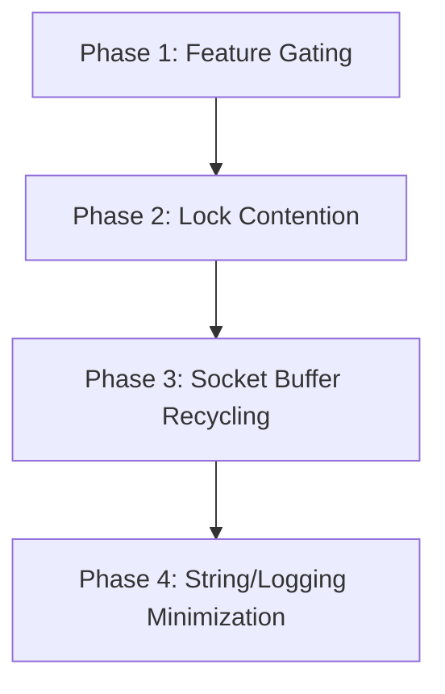

# BitTorrent Library Size & Performance Optimization Plan

This document outlines a concrete, actionable refactoring plan to minimize binary size, reduce memory footprints, and optimize execution performance for the `bittorrent-rs` library.

---

## 1. Performance Optimizations (CPU & Memory)

### A. Lock Contention Reduction on `TorrentContext`
Currently, the client runs peer connections on separate threads. Each connection frequently locks the global `TorrentContext` via `Arc<Mutex<TorrentContext>>` for reading and writing state. This causes high CPU thread contention under high peer counts.

*   **Proposed Refactoring**:
    *   Change read-heavy fields in [torrent_context.rs](file:///c:/Projects/BitTorrent/library/src/core/torrent_context.rs) (like piece counts, total download length, and trackers) to use atomic primitives (`AtomicU64`, `AtomicUsize`) or wrap them in an `RwLock` instead of a `Mutex`.
    *   Transition to a message-passing architecture where peer sessions send progress updates via a lock-free `mpsc` channel, allowing a single coordinator thread to update the context without lock contention.

### B. Network Socket Frame Optimization
In [peer_network.rs](file:///c:/Projects/BitTorrent/library/src/network/peer_network.rs), read and write operations allocate and copy packet buffers frequently.
*   **Proposed Refactoring**:
    *   Implement buffer recycling or ring-buffers for network sockets using a thread-local or static `Pool<Vec<u8>>` to eliminate dynamic allocation overhead during active 16 KiB block transfers.
    *   Use vectored I/O (`write_vectored` or `read_vectored`) where supported to write message headers and block payloads in a single syscall.

### C. Optimize uTP Congestion Window and Resends
In [utp.rs](file:///c:/Projects/BitTorrent/library/src/network/utp.rs), packets are acknowledged and retransmitted individually.
*   **Proposed Refactoring**:
    *   Optimize uTP sliding window arithmetic to process packet ranges and utilize selective acknowledgments (SACK) to reduce unnecessary packet retransmission overhead.

---

## 2. Binary Size Reduction

### A. Modular Feature Gating
Currently, the library compiles all subsystems (DHT, LSD, PEX, WebSeed, MSE Encryption, uTP, NAT-PMP) into a single bundle. Many applications only need a subset of these features.

*   **Proposed Refactoring**:
    *   Introduce optional features in `library/Cargo.toml`:
        ```toml
        [features]
        default = ["std", "http-tracker"]
        dht = []       # Gated on network/dht.rs
        lsd = []       # Gated on network/lsd.rs
        utp = []       # Gated on network/utp.rs
        nat-pmp = []   # Gated on network/nat.rs
        mse = []       # Gated on network/mse.rs
        webseed = []   # Gated on session/webseed.rs
        ```
    *   Wrap references to these modules in `#[cfg(feature = "...")]` attributes across [lib.rs](file:///c:/Projects/BitTorrent/library/src/lib.rs) and [session.rs](file:///c:/Projects/BitTorrent/library/src/session/session.rs).

### B. Consolidate Hashing and Cryptographic Footprint
The library pulls in `sha1`, `sha2`, and custom RC4/Diffie-Hellman algorithms.
*   **Proposed Refactoring**:
    *   Gated features: enable `sha2` only if `v2` torrent support is explicitly requested.
    *   Unify internal hashing helper routines under a unified `crypto` module to avoid compiling duplicate hashing wrappers or macro expansions.

### C. Remove Formatting/String Allocations in Core
Error messages and debugging traces inside [error.rs](file:///c:/Projects/BitTorrent/library/src/utils/error.rs) and logging macros contain extensive string constants which bloat the compiled binary.
*   **Proposed Refactoring**:
    *   Eliminate formatting strings in error enums by replacing string descriptions with structured error codes.
    *   Refactor the `log_debug!` macro under `#![no_std]` targets to strip out format statements entirely, removing all log strings from the final compiler output.

---

## 3. Implementation Steps



### Phase 1: Feature Gating (Binary Size)
1. Edit `library/Cargo.toml` to declare features for `dht`, `lsd`, `utp`, `nat-pmp`, `mse`, and `webseed`.
2. Apply `#[cfg(feature = "...")]` guards on imports, exports, and struct initializers.
3. Verify compilation size differences by compiling with/without features.

### Phase 2: Lock Contention Reduction (Performance)
1. Change `TorrentContext` field synchronization from global `Mutex` to granular `RwLock` or atomics where possible.
2. Refactor peer loop callbacks in `worker.rs` to send socket state updates rather than locking and mutating the context directly.

### Phase 3: Socket Buffer Recycling (Performance)
1. Add a lock-free buffer pool for TCP/uTP socket packets.
2. Replace heap-allocated byte vectors in `PeerNetwork` message serialization with reusable static buffer slices.

### Phase 4: String/Logging Minimization (Binary Size)
1. Refactor `BitTorrentError` variants to remove `String` payloads.
2. Audit all logging statements in worker threads to ensure they compile down to empty blocks under production release profile builds.
