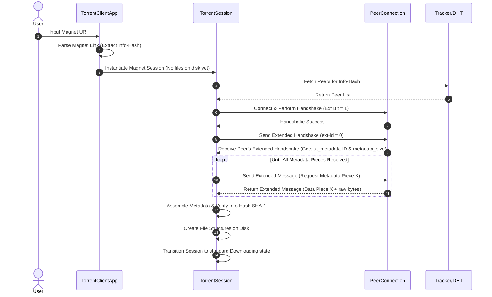

# Implementation Plan: Magnet Link & Metadata Extension Support (BEP 9 / BEP 10)

This document provides a concrete technical design and implementation plan for adding **Magnet Link Support (BEP 9)** and the **Extension Protocol (BEP 10)** to the BitTorrent library.

---

## 1. Goal Description

Currently, the library requires a local `.torrent` file to initialize a download session. Modern BitTorrent clients rely on **Magnet Links** to bootstrap download sessions. 

To support magnet links, the library must:
1. Parse magnet URIs to extract the info-hash, display name, and bootstrap tracker URLs.
2. Connect to trackers or the DHT to discover peers using the info-hash.
3. Establish connections to peers and announce support for the **Extension Protocol (BEP 10)**.
4. Exchange **Metadata Extension (BEP 9)** packets with peers to download the torrent metainfo dictionary block-by-block.
5. Parse the downloaded metadata in-memory, write it to disk, and transition the session into a standard download state.

---

## 2. Protocol Specifications

### BEP 10: Extension Protocol
The extension protocol provides a backwards-compatible framework for extending the BitTorrent wire protocol.
* **Handshake Identifier**: Support is negotiated during the initial handshake by setting the `0x00` bit in the 8 reserved bytes to `1` (specifically `reserved[5] |= 0x10`).
* **Extended Message ID**: A new peer wire message `Extended (ID = 20)` is introduced:
  ```text
  <length-prefix: u32> <id: u8 = 20> <ext-id: u8> <payload: bencode dict>
  ```
* **Handshake Exchange**: Once connected, peers exchange an extended handshake (where `ext-id = 0`). The payload is a bencoded dictionary describing supported extensions and mapping them to local message IDs (e.g., `{"m": {"ut_metadata": 1}, "metadata_size": 28120}`).

### BEP 9: Extension for Torrent Metadata Files
Once the `ut_metadata` ID map is established via the handshake, peers can request metadata pieces (typically 16 KiB blocks):
* **Message Payload**: The message format is a bencoded dictionary followed by the raw binary metadata payload (for data responses):
  ```text
  { "msg_type": i32, "piece": i32, "total_size": i32 (optional) }
  ```
* **Message Types (`msg_type`)**:
  * `0` — **Request**: Ask for a specific metadata piece.
  * `1` — **Data**: Provide a metadata piece (followed by raw bytes).
  * `2` — **Reject**: Refuse to send the requested metadata piece.

---

## 3. Architecture & Data Flow



---

## 4. Proposed Code Changes

### Component 1: Magnet URI Parsing

#### [NEW] [magnet.rs](file:///c:/Projects/BitTorrent/library/src/magnet.rs)
Create a helper module to parse magnet links and represent their properties:
```rust
use crate::error::BitTorrentError;

pub struct MagnetLink {
    pub info_hash: Vec<u8>,
    pub display_name: Option<String>,
    pub trackers: Vec<String>,
}

impl MagnetLink {
    /// Parses a magnet URI string. Supported format:
    /// magnet:?xt=urn:btih:<hex-or-base32-hash>&dn=<name>&tr=<tracker>
    pub fn parse(uri: &str) -> Result<Self, BitTorrentError> {
        // Validation and key-value query parsing
        // Convert base32/hex info-hashes to standard 20-byte arrays
    }
}
```

### Component 2: Protocol Extensions

#### [MODIFY] [peer_message.rs](file:///c:/Projects/BitTorrent/library/src/peer_message.rs)
Add support for the `Extended` message ID in serialization/deserialization:
```rust
pub enum PeerMessage<'a> {
    // Existing variants ...
    Extended {
        ext_id: u8,
        payload: &'a [u8], // Bencoded dictionary + optional raw bytes
    },
}
```

#### [MODIFY] [peer.rs](file:///c:/Projects/BitTorrent/library/src/peer.rs)
Update peer state and message handling:
- Add `supports_extensions: bool` and `extension_ids: HashMap<String, u8>` to `Peer`.
- Set the extension bit in outgoing handshakes.
- In `handle_peer_message`, handle the `Extended` message type.
- Implement parsing for the extended handshake (mapping `ut_metadata` to local IDs) and trigger callbacks to the session thread when metadata chunks arrive.

### Component 3: Metadata Bootstrap Session

#### [MODIFY] [session.rs](file:///c:/Projects/BitTorrent/library/src/session.rs)
Extend `TorrentSession` to handle a metadata-only bootstrap state:
- Add a constructor `TorrentSession::new_magnet(magnet_uri: &str, download_path: &Path)` which returns a session in `Initialised` status but with `total_bytes_to_download = 0` and empty file definitions.
- Implement a metadata manager that tracks missing 16 KiB chunks of the metainfo file.
- Once the metadata file is fully assembled and verified against the magnet's info-hash:
  1. Write the `.torrent` file to the download directory for future persistence.
  2. Parse the metadata dictionary to update `files_to_download` and initialize the local storage layout (`DiskIO`).
  3. Resume standard BitTorrent piece requests.

---

## 5. Verification Plan

### Automated Unit Tests
1. **Magnet Link Parsing Tests**: Add unit tests in `library/tests/magnet_tests.rs` verifying successful hex-encoded and base32-encoded info-hash extractions, and tracker parameters mapping.
2. **Extended Message Framing Tests**: Verify serialization and parsing of `PeerMessage::Extended` frames.

### Mock Socket Integration Tests
Extend `library/tests/integration_tests.rs` to simulate a metadata download loop using in-memory `MockSocket` streams:
- Assert that the client initiates the extension handshake.
- Feed a mock peer's extended handshake back to the client.
- Feed mock metadata response packets block-by-block and assert the client successfully validates and reassembles the metadata file.

### Manual Verification
1. Run the example tool using a public magnet link (e.g. Ubuntu torrent magnet link).
2. Verify that the client connects to tracker servers, discovers peers, downloads the metainfo file, and starts downloading files immediately.
