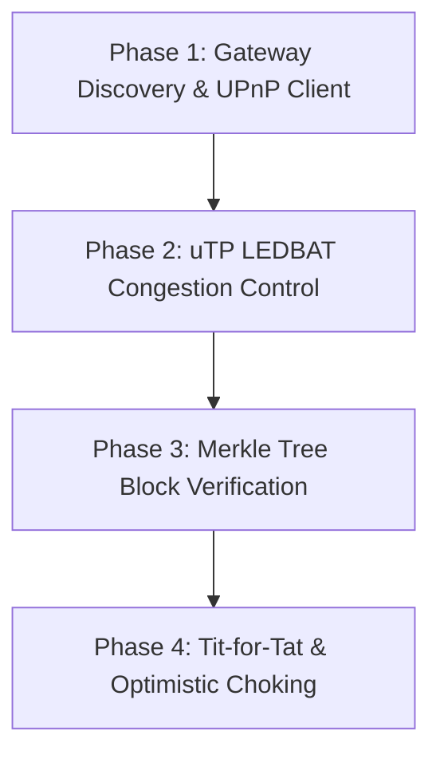

# Concrete Refactoring Plan: Implementing Missing BitTorrent Features

This document outlines the analysis and concrete implementation strategy to add missing BitTorrent protocol features to the `bittorrent-rs` library. These enhancements will elevate the library's performance, router compatibility, download integrity, and swarm efficiency to production grade.

---

## 1. UPnP / SSDP Auto Port Mapping

### Analysis & Goal
Currently, the library only supports **NAT-PMP** for port forwarding. While widely supported, many legacy or consumer-grade routers only support **UPnP** (Universal Plug and Play) using Simple Service Discovery Protocol (SSDP) and SOAP over HTTP.

### Implementation Strategy
1. **SSDP Discovery**:
   - Send an M-SEARCH UDP multicast packet to `239.255.255.250:1900`.
   - Parse the `LOCATION` header from the response to obtain the XML device description URL.
2. **SOAP Control URL Extraction**:
   - Perform an HTTP GET to retrieve the XML description.
   - Parse the XML to locate the `WANIPConnection` or `WANPPPConnection` service and extract its `controlURL`.
3. **Port Mapping Requests**:
   - Send POST requests containing SOAP XML payloads to add (`AddPortMapping`) or remove (`DeletePortMapping`) TCP/UDP port redirections.
4. **Integration**:
   - Wrap both `UPnP` and `NAT-PMP` clients behind a unified `PortMapper` trait.
   - Attempt NAT-PMP first, fallback to UPnP, and gracefully continue if both fail.

---

## 2. LEDBAT Congestion Control for uTP (RFC 6817)

### Analysis & Goal
The current `UtpSocketAdapter` uses a fixed 1 MiB receive window and does not dynamically adjust its sending rate. Implementing the **Low Extra Delay Background Transport (LEDBAT)** algorithm ensures that uTP connections do not saturate the user's internet link by backing off when queuing delay is detected.

### Implementation Strategy
1. **One-Way Delay Tracking**:
   - Compute `timestamp_difference_us` = `local_time - remote_timestamp` for each received packet.
   - Maintain a rolling minimum of these values over the last 2–10 minutes to establish the base propagation delay (`base_delay`).
   - Calculate current queuing delay: `queuing_delay = current_delay - base_delay`.
2. **Dynamic Window Adjustment**:
   - Target queuing delay = 100ms (`100_000` microseconds).
   - If `queuing_delay < target_delay`, increase the congestion window (`cwnd`) proportionally.
   - If `queuing_delay >= target_delay` or packet loss occurs, decrease `cwnd` exponentially.
3. **Packet Retransmission & RTT**:
   - Track outstanding packets in a sent queue.
   - Calculate smoothed round-trip time (SRTT) and retransmit packets if they are not acknowledged within the retransmission timeout (RTO).

---

## 3. BEP 52 Merkle Tree Block Validation

### Analysis & Goal
For BitTorrent v2 torrents, the library parses v2 metadata and calculates 32-byte SHA-256 info-hashes. However, it lacks the ability to validate individual blocks against per-file `pieces_root` Merkle trees. Implementing this allows block-level integrity checks, preventing corrupt peers from forcing a redownload of entire pieces.

### Implementation Strategy
1. **Merkle Tree Structure**:
   - Define a `MerkleTree` helper that builds and maintains SHA-256 leaf and parent nodes for a given file size and block index layout.
2. **Uncle Verification**:
   - When a peer sends a block, they optionally provide the authentication path (uncle hashes).
   - Recompute the root of the Merkle tree using the downloaded block and the uncle hashes, and verify it matches the file's `pieces_root` hash defined in the `.torrent` file.
3. **Integration**:
   - Update `process_piece_block` in `torrent_context.rs` to validate the block immediately before writing it to `BlockStorage`.

---

## 4. Tit-for-Tat Upload Choking & Optimistic Unchoking

### Analysis & Goal
The client currently lacks a choke allocation algorithm, meaning it does not prioritize high-performing peers or dynamically seed the swarm. Implementing standard BitTorrent choking algorithms maximizes download rates and optimizes seed performance.

### Implementation Strategy
1. **Tit-for-Tat Choking (BEP 3)**:
   - Measure the rolling download speed of all interested peers over a 10-second window.
   - Sort peers by download rate and unchoke the top $N$ peers (typically 4).
   - Choke all other interested peers.
2. **Optimistic Unchoking**:
   - Periodically (every 30 seconds), select one random interested, choked peer and unchoke them.
   - This allows new peers to bootstrap their downloads and discover if they can provide faster upload rates.
3. **Seeding Choking**:
   - When seeding, sort peers by their rolling upload rates to optimize the distribution of pieces throughout the swarm.

---

## 5. Gateway Discovery & Mapping Renewal Loop

### Analysis & Goal
Currently, the client uses a `.1` IP address heuristic to find the gateway, which is fragile on complex subnets. Additionally, port mappings are not renewed and will expire after `lifetime_secs` (default: 3600s).

### Implementation Strategy
1. **OS Routing Table Query**:
   - Integrate platforms-specific system queries (e.g., Netlink on Linux, IP Helper on Windows) or lightweight dependencies to retrieve the exact IP address of the active default gateway.
2. **Background Renewal Loop**:
   - Spawn a long-running cooperative timer loop in `TorrentSession`.
   - Every `lifetime_secs * 0.8` seconds, send mapping renewal requests to the router to keep the port redirection active.

---

## 6. Proposed Implementation Phases

### Phase 1: Gateway Discovery & UPnP Client
- Implement SSDP discovery and SOAP client.
- Replace `.1` gateway heuristic with routing table checks.
- Add UPnP fallback logic to the session initialization.

### Phase 2: uTP LEDBAT Congestion Control
- Add a sent-packets tracker to `UtpSocketAdapter`.
- Compute dynamic RTT and queuing delay.
- Implement sliding window scaling and packet retransmission.

### Phase 3: Merkle Tree Block Verification
- Implement Merkle tree hashing validators.
- Integrate block-level validation in `process_piece_block`.

### Phase 4: Tit-for-Tat & Optimistic Choking
- Add rolling peer download/upload rate counters.
- Spawn a periodic choking manager loop in `TorrentSession`.
