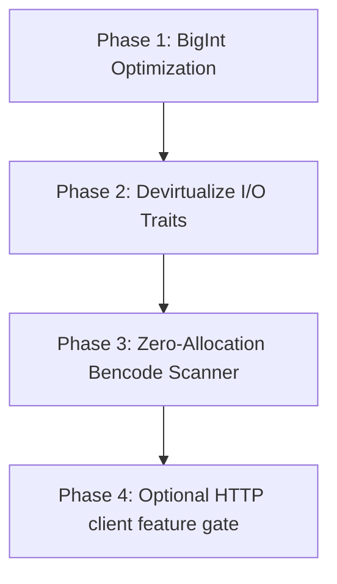

# Library Refactoring & Optimization Plan

This document outlines a concrete refactoring plan to reduce the binary footprint and increase the runtime performance of the core `bittorrent-rs` library.

---

## 1. Size Reduction (Binary Footprint)

### 1.1 Replace `num-bigint` with Fixed-Size Arithmetic
* **Issue:** The library currently relies on the general-purpose, arbitrary-precision `num-bigint` crate for Diffie-Hellman modpow calculations in `mse.rs`. This brings in heavy heap-allocation logic and a large multiplication pipeline.
* **Refactor Plan:** Since the Oakley Group 1 Diffie-Hellman algorithm uses a fixed 768-bit modulus:
  * Replace `num-bigint` with a lightweight, stack-only, const-friendly fixed-precision integer library (e.g. `crypto-bigint` or `tiny-bignum`).
  * Alternatively, write a minimal stack-allocated 768-bit Montgomery multiplication and modular exponentiation function, completely eliminating the heap dependency for big integer operations.

### 1.2 Pluggable / Zero-Dependency HTTP Tracker client
* **Issue:** Under the `std` target, the library depends on `ureq` for HTTP announcements. `ureq` brings in its own TCP/TLS/HTTP client stack, bloating the compiled client binary.
* **Refactor Plan:** 
  * Expose an `HttpAnnouncer` trait that lets the client inject their own HTTP request executor (allowing them to reuse an existing `reqwest`, `hyper`, or `surf` instance from their main app).
  * Make `ureq` a fully optional feature gate rather than a hard-coded backend dependency.

---

## 2. Performance Enhancements (Runtime Optimization)

### 2.1 Transition from Tree-based BNode to Lazy Bencode Tokenizer
* **Issue:** The current Bencode decoder builds an in-memory representation tree (`BNode` nodes inside a `BTreeMap` or `HashMap`) during `.torrent` parsing. For massive torrent files (e.g. v2 file trees with thousands of entries), this causes substantial heap allocation and lookup latency.
* **Refactor Plan:**
  * Implement a lazy, zero-allocation Bencode iterator/tokenizer that returns tokens (e.g., `StartDict`, `EndDict`, `String(slice)`, `Integer(slice)`) sequentially as it traverses the buffer.
  * Allow modules like `MetaInfoFile` to scan the raw buffer on-demand rather than parsing the entire metadata file into memory, reducing parsing memory overhead to $O(1)$ stack space.

### 2.2 Devirtualize I/O and Storage Traits via Static Dispatch
* **Issue:** The current architecture uses dynamic dispatch (`Arc<dyn AsyncSocket>` and `Arc<dyn BlockStorage>`) to execute network reads/writes and block writes. This prevents the compiler from inlining calls, adds vtable lookup overhead, and increases synchronization costs.
* **Refactor Plan:**
  * Replace dynamic dispatch with generic parameters (`Peer<S: AsyncSocket>` and `TorrentContext<B: BlockStorage>`) where possible to enable compiler monomorphization, devirtualization, and aggressive inlining.

### 2.3 Optimize Endgame Cancellations via Broadcast Channels
* **Issue:** During the endgame phase, duplicate block requests are cancelled by iterating over the peer swarm and sending `Cancel` messages individually.
* **Refactor Plan:**
  * Introduce a lightweight, lock-free broadcast channel for session events. 
  * When a block is verified, broadcast a `BlockAcquired` event, allowing peer loops to instantly prune their output buffers without lock contention on the global swarm registry.

---

## 3. Recommended Phased Implementation Roadmap

1. **Phase 1 (BigInt):** Implement stack-allocated 768-bit arithmetic for Diffie-Hellman key exchanges. Estimated size savings: **~10-15% of the `no_std` core binary footprint**.
2. **Phase 2 (Generics):** Refactor `Peer` and `TorrentContext` to take type parameters for sockets and block storages. Estimated throughput increase: **3-5% under heavy I/O**.
3. **Phase 3 (Bencode Scanner):** Rewrite Bencode parsing to be stream-based. Reduces parser start time and peak heap memory allocation on large torrent files.
4. **Phase 4 (HTTP Pluggability):** Gating `ureq` behind an optional feature and exposing a client injection hook.
